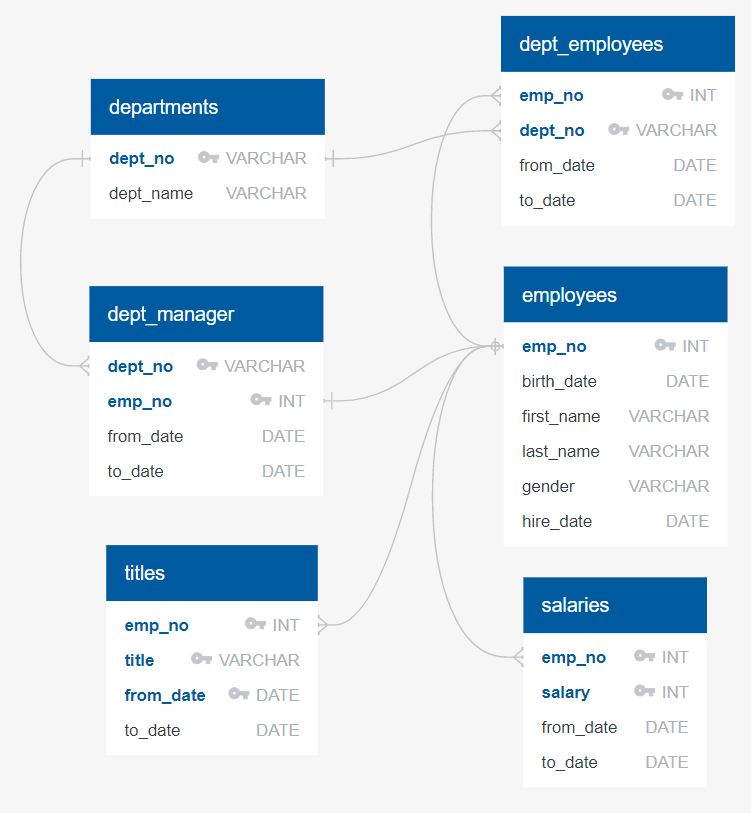
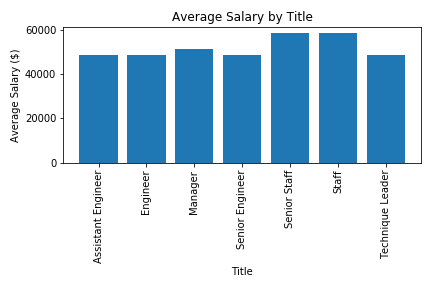
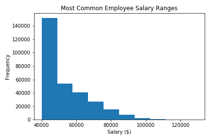

# Unit 9 – SQL Web Homework, PewlettHackard Employee Database

## **Objective:**
The objective of this project is to use SQL to perform data modeling, engineering and analysis of an employee database originally stored in 6 CSV files. The following steps were taken:

* **Data Modeling:** Inspected the CSV files and created an ERD of the tables.
* **Data Engineering:** Created a table schema for each CSV file and imported each file into the corresponding SQL table.
* **Data Analysis:** Created various tables including: 
  - Employee summary table
  - List of employees hired in 1986
  - Manager summary table
  - List of all employees in the Sales and Development departments
  - Frequency count of employee last names
  - Average salary by title
  - Most common employee salary ranges

## **Tools:**
1. SQL

## **Screenshots:**

